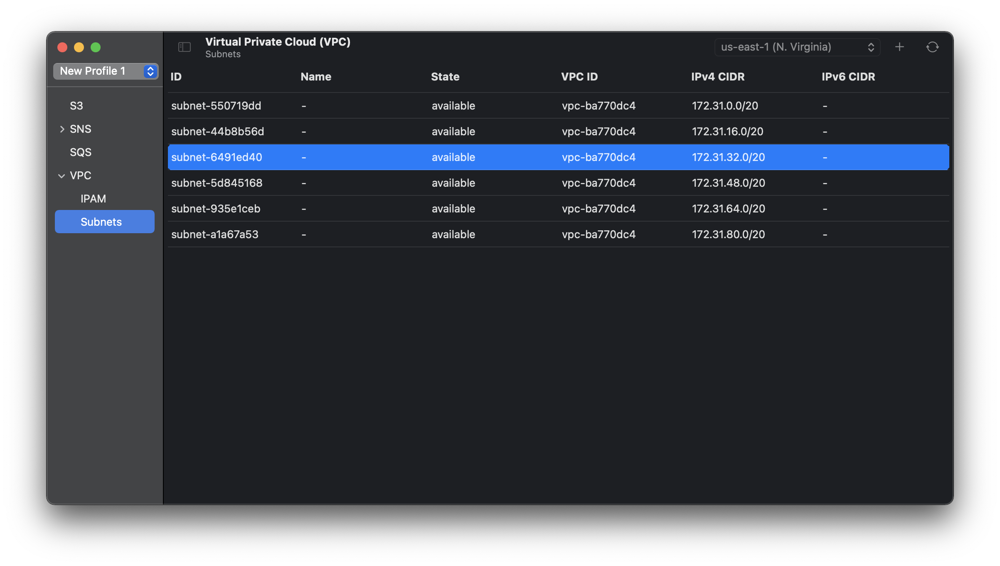

# Stackmon

A sleek macOS app for visualizing and managing your [Localstack](https://localstack.cloud/) instance.

## About

Stackmon is a native macOS desktop app that provides a simple UI for working with Localstack. The goal is to make certain
operations easier, such as publishing events to SNS topics and managing S3 buckets. This is not intended to be a complete 
replacement for the AWS CLI; given the breadth of functionality present in Localstack, this project aims to implement the
most useful subset of services that are more commonly used in day to day development and testing.

## Developing

You'll need macOS 11.x and Xcode 12.x. All dependencies are configured using SPM, and no external tools are required.

Open the project in Xcode and simply build and run the app. 

## Contributing

All contributions are welcome! Feel free to open a pull request if there is something you'd like to pitch in for the project. 
